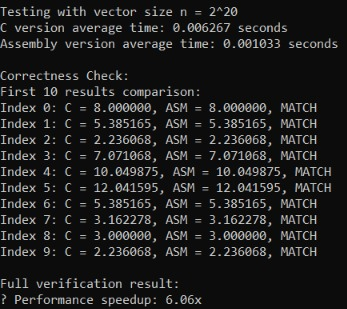
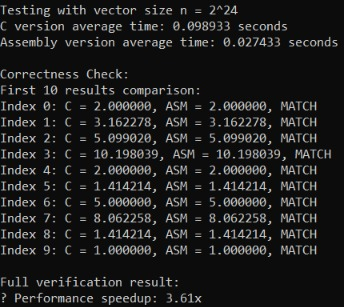
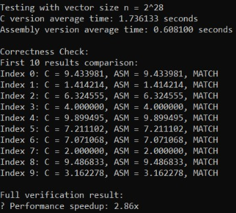

# Musngi-Olivares-x86toC

## Execution Time Comparison

| Input Size | C version avg | Assembly version avg | Speedup |
| ---------- | --------------| -------------------- | ------- |
| 2^20       | 0.006267 s    | 0.001033 s           | 6.06x   |
| 2^24       | 0.098933 s    | 0.027433 s           | 3.61x   |
| 2^28       | 1.736133 s    | 0.608100 s           | 2.86x   |

## Correctness Checks

### 2^20

### 2^24

### 2^28

